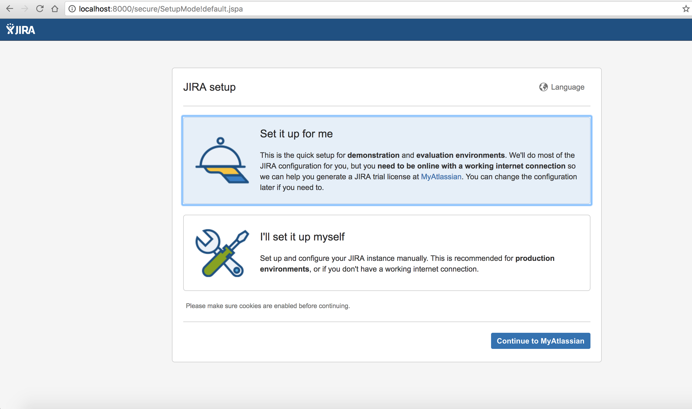

# debian-jira
Dockerized jira service, built on top of official Debian images.
Min 2GB Ram, 10GB Disk Size

## Supported tags and respective Dockerfile links

| Product |Version | Tags  | Dockerfile |
|---------|--------|-------|------------|
| Jira Software | 7.5.0 | v7.5.1, latest | [Dockerfile](https://github.com/thinegan/debian-jira/blob/master/Dockerfile) |
| Jira Software | 7.5.0 | v7.5.0 | [Dockerfile](https://github.com/thinegan/debian-jira/blob/master/Dockerfile) |
| Jira Software | 7.4.2 | v7.4.2 | [Dockerfile](https://github.com/thinegan/debian-jira/blob/master/Dockerfile) |

# Installed packages
* Debian GNU/Linux 9 (Stretch) x64bit
* Oracle Java 8 
* mysql-connector-java
* Atlassian Jira

# Config:
* Dependencies Package:
  * software-properties-common
  * gnupg 
  * curl
  * wget
  * xmlstarlet

# Shortcut
Docker-Compose:
```console
$ curl -O https://raw.githubusercontent.com/thinegan/debian-jira/master/docker-compose.yml
$ docker-compose pull && docker-compose up -d
```

# Docker-CLI:
```console
$ docker run -d -p 8000:8080 \
-v /home/user/jira-data:/home/www/public_html/jira-data.server.com \
--name jira thinegan/debian-jira:v7.5.0
```

# More Info:
* Jira will be available at http://yourdockerhost:8000.
* Data will be persisted inside docker volume `jira-data`.
* host path : /home/user/jira-data
* container path : /home/www/public_html/jira-data.server.com
* you can use mysql from endpoint connection
* exposed port 8080
* default command: jira start

# Example:


# Issues
If you run into any problems with this image, please check (and potentially file new) issues on the [thinegan/debian-jira](https://github.com/thinegan/debian-jira) repo, which is the source for this image.

# References
* [Atlassian Jira](https://www.atlassian.com/software/jira)
* [Docker Homepage](https://www.docker.com/)
* [Docker Compose](https://docs.docker.com/compose/)
* [Docker Userguide](https://docs.docker.com/userguide/)
* [Oracle Java](https://java.com/en/download/)
